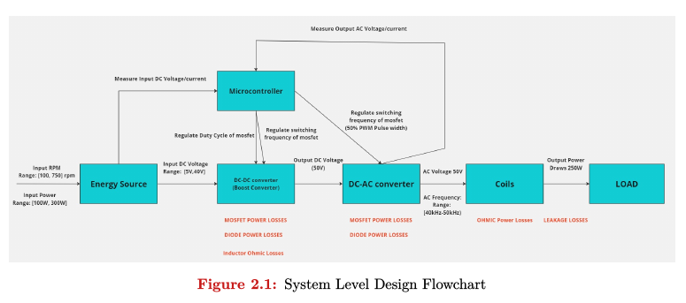
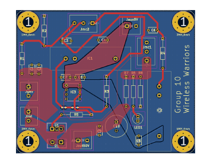
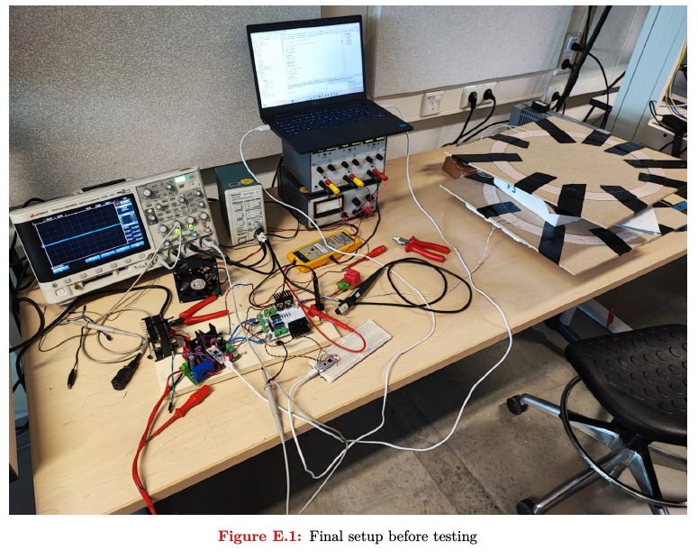

# Wireless Energy Transfer (5XWF0)

Challenge-based learning project for the 5XWF0 Wireless Energy Transfer course at TU
Eindhoven, Q4 2024, built by a team of nine. The goal was to wirelessly power a desktop PC
from a sustainable energy source across an air gap of 10 to 20 cm, delivering at least
100 W and tracking the maximum power point. The full chain is a generator (energy source),
a DC/DC boost converter that stabilizes the variable input to 50 V, a full-bridge DC/AC
inverter, a pair of resonant magnetically coupled coils, an AC/DC rectifier, and the load,
all coordinated by a microcontroller that measures voltages and currents and sets the PWM
duty cycle and switching frequency.



My part of the project was the DC/DC boost converter: the topology and component choices,
a MATLAB script for selecting the inductor and capacitor values, the KiCad PCB, and the
hardware testing. The sections and appendices for that subsystem in the final report are
mine (design choices, testing, and the component-selection script).

## The DC/DC boost converter

The converter takes the generator's variable rectified DC (up to 30 V, limited to 10 A)
and boosts it to a regulated 50 V for the rest of the chain. Design decisions and their
reasoning:

- **Topology.** A standard boost converter, chosen over buck-boost and Cuk alternatives.
  Those give a wider input range but add an inverted output, a negative gate-drive supply,
  or a second inductor, all of which raise complexity and losses.
- **Passives.** A 75 to 125 uH inductor sized to keep the converter in continuous
  conduction mode with margin, and a 220 uF output capacitor. In simulation this holds the
  output at about 49 V with 4.95 % ripple, inside the 5 % requirement. The minimum values
  were computed with a MATLAB script that sweeps the input voltage range (`Appendix D` of
  the report).
- **Switches and diode.** An IRF640 power MOSFET, picked over the IRF630 because its lower
  on-resistance cuts conduction losses more than the added switching loss costs, and an
  MBR10100+ Schottky diode rated for the worst-case current at low duty cycle.
- **Switching frequency.** 20 kHz, a tradeoff that keeps switching losses low while still
  meeting the ripple targets without an oversized inductor.
- **Control.** A low-side gate driver so the microcontroller can drive the duty cycle
  directly, with the duty cycle held near 0.5 and constrained to keep the input current
  under the 10 A generator limit.

The board was laid out in KiCad with a continuous ground plane, current-scaled trace
widths, and component placement chosen to spread heat and limit EMI.



Testing started at low voltage and current on the PCB, cross-checked against the
breadboard build to isolate faults (a diode footprint mismatch, misplaced input
capacitors, and wrong voltage-divider resistor values were found and fixed), then ramped
up to 150 W.

## Result

The integrated system reached a tested peak efficiency of 77.36 % at 180.80 W output,
passing the 100 W minimum. The power electronics PCBs worked as designed. MPPT and
automatic load detection were designed but not fully brought up in hardware within the
project time, and the report documents the gap between the MATLAB and Simulink models and
the measured system as the main lesson for future work.



## Repository structure

```
5XWF0_Final_Report.pdf      full team report (design, models, testing, results)
dc-to-dc-maker/             DC/DC boost converter: KiCad project, gerbers, part libraries
dc-to-ac-maker/             DC/AC full-bridge inverter KiCad project
CODING/                     microcontroller firmware (STM32 F303K8 and ESP32), PWM/ADC/MPPT
STM32 - F303K8 code/        packaged STM32CubeIDE firmware builds
team-microcontroller/       microcontroller subteam working files
*.slx                       Simulink models of the full system
```

## Building and running

The converter and inverter boards open in KiCad (`.kicad_pro` / `.kicad_pcb` /
`.kicad_sch`), with gerbers included for fabrication. The firmware under
`CODING/Final Codes/C-Code` is STM32CubeIDE C for the Nucleo F303K8 (PWM plus ADC
variants, including an MPPT-via-ADC version). The `.slx` files are Simulink models of the
full transfer chain and are opened in MATLAB/Simulink.

## Technologies

KiCad (PCB design and gerbers), power electronics (boost converter, full-bridge inverter,
resonant inductive coupling), MATLAB and Simulink, STM32 (Nucleo F303K8, STM32CubeIDE, C)
and ESP32 firmware, and bench testing with an oscilloscope and impedance analyzer.
